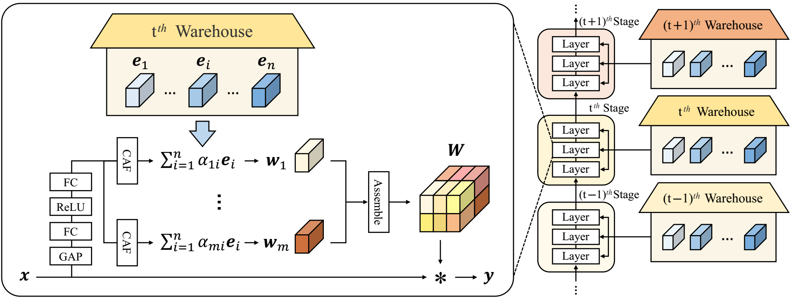

# KernelWarehouse: Rethinking the Design of Dynamic Convolution

By Chao Li and Anbang Yao.

This repository is an official PyTorch implementation of ["KernelWarehouse: Rethinking the Design of Dynamic Convolution", KW for short, which has been accepted to ICML 2024]([http://arxiv.org/abs/2406.07879]). 

Dynamic convolution learns a linear mixture of n static kernels weighted with their input-dependent attentions, demonstrating superior performance than normal convolution. However, it increases the number of convolutional parameters by n times, and thus is not parameter efficient. This leads to no research progress that can allow researchers to explore the setting n>100 (an order of magnitude larger than the typical setting n<10) for pushing forward the performance boundary of dynamic convolution while enjoying parameter efficiency. To fill this gap, in this paper, we propose **KernelWarehouse**, a more general form of dynamic convolution, which redefines the basic concepts of "kernels", "assembling kernels" and "attention function" through the lens of exploiting convolutional parameter dependencies within the same layer and across neighboring layers of a ConvNet. We testify the effectiveness of KernelWarehouse on [ImageNet](http://www.image-net.org) and [MS-COCO](https://cocodataset.org/#home) datasets using various ConvNet architectures. Intriguingly, KernelWarehouse is also applicable to Vision Transformers, and it can even reduce the model size of a backbone while improving the model accuracy. For instance, KernelWarehouse (n=4) achieves 5.61%|3.90%|4.38% absolute top-1 accuracy gain on the ResNet18|MobileNetV2|DeiT-Tiny backbone, and KernelWarehouse (n=1/4) with 65.10% model size reduction still achieves 2.29% gain on the ResNet18 backbone. 

<p align="center"></p>

Schematic illustration of KernelWarehouse. Briefly speaking, KernelWarehouse sequentially divides the static kernel $\mathbf{W}$ at any regular convolutional layer of a ConvNet into $m$ disjoint kernel cells $\mathbf{w}_ 1, \dots, \mathbf{w}_ m$ having the same dimensions first, and then computes each kernel cell $\mathbf{w}_ i$ as a linear mixture $\mathbf{w}_ i=\alpha_{i1} \mathbf{e}_ 1+\dots+\alpha_{in}\mathbf{e}_ n$ based on a predefined "warehouse" (consisting of $n$ same dimensioned kernel cells $\mathbf{e}_ 1,\dots,\mathbf{e}_ n$ , e.g., $n=108$) which is shared to all same-stage convolutional layers, and finally replaces the static kernel $\mathbf{W}$ by assembling its corresponding $m$ mixtures in order, yielding a high degree of freedom to fit a desired convolutional parameter budget. The input-dependent scalar attentions $\alpha_{i1},\dots,\alpha_{in}$ are computed with a novel contrasting-driven attention function (CAF).

## Dataset

Following [this repository](https://github.com/pytorch/examples/tree/master/imagenet#requirements),

- Download the ImageNet dataset from http://www.image-net.org/.
- Then, move and extract the training and validation images to labeled subfolders, using [the following script](https://github.com/pytorch/examples/blob/main/imagenet/extract_ILSVRC.sh).

## Requirements

- python >= 3.7.0
- torch >= 1.8.1, torchvision >= 0.9.1
- timm == 0.3.2, tensorboardX, six

## Results and Models

Results comparison on the ImageNet validation set with the ResNet18, ResNet50 and ConvNeXt-Tiny backbones trained for 300 epochs.

| Models      | Params  | Top-1 Acc(%) | Top-5 Acc(%) |                                        Google Drive                                         |                            Baidu Drive                            |
|:------------|:-------:|:------------:|:------------:|:-------------------------------------------------------------------------------------------:|:-----------------------------------------------------------------:|
| ResNet18    | 11.69M  |    70.44     |    89.72     | [model](https://drive.google.com/file/d/1xpAiJyjVycr6b0RyKsDTXbUUz7etA2UV/view?usp=sharing) | [model](https://pan.baidu.com/s/16IRpCY0l_uHhJd-FMWllGg?pwd=w46e) |
| + KW (1/4×) |  4.08M  |    72.73     |    90.83     | [model](https://drive.google.com/file/d/1DMcTWMLjiLRpY38041nLlOU0Vb_zmUh6/view?usp=sharing) | [model](https://pan.baidu.com/s/11nv7S5oH7DHkuzCXgQbiXA?pwd=marv) |
| + KW (1/2×) |  7.43M  |    73.33     |    91.42     | [model](https://drive.google.com/file/d/1k5tyyDHu9mqsQtiwZu7tTMPPolPOjdbT/view?usp=sharing) | [model](https://pan.baidu.com/s/1bOjjVf5Z2YdKs5d7NlPamQ?pwd=t8ax) |
| + KW (1×)   | 11.93M  |    74.77     |    92.13     | [model](https://drive.google.com/file/d/1aLaO8QV9QYdfv5GE2tg9iDWLeEJfkrKY/view?usp=sharing) | [model](https://pan.baidu.com/s/1TPcg7iMNdA_7w2FlkZaFWg?pwd=tu3x) |
| + KW (2×)   | 23.24M  |    75.19     |    92.18     | [model](https://drive.google.com/file/d/1UB7nrqI2mkAIY_p7I5eOcitrmKYbjtsj/view?usp=sharing) | [model](https://pan.baidu.com/s/1WODJhFpgG8IPtZDeiOCFuw?pwd=jhtg) |
| + KW (4×)   | 45.86M  |    76.05     |    92.68     | [model](https://drive.google.com/file/d/1gl1__aDrJIMs-Zrv3IgH7mfVnwgFCLbr/view?usp=sharing) | [model](https://pan.baidu.com/s/1u1jiDOt8IkE3nakFJPRkzA?pwd=75f1) |
| ResNet50    | 25.56M  |    78.44     |    94.24     |                                          [model](https://drive.google.com/file/d/1x57Lip3xt1yFYGz7k6aCTR2yhP56TtKM/view?usp=sharing)                                          | [model](https://pan.baidu.com/s/1O3CiCq1BNssIL1L2jNV_IA?pwd=ufyh) |
| + KW (1/2×) | 17.64M  |    79.30     |    94.71     |                                          [model](https://drive.google.com/file/d/1lm_TlIUX7nmyjM7HNDWb7SxO65rgyrF9/view?usp=sharing)                                          | [model](https://pan.baidu.com/s/1TeIqjTrUzNobDr07gN1dUw?pwd=7b6j) |
| + KW (1×)   | 28.05M  |    80.38     |    95.19     |                                          [model](https://drive.google.com/file/d/1lA155EYydHae_m__hk86tX_m9S0i85i8/view?usp=sharing)                                          | [model](https://pan.baidu.com/s/1moFwCD7PhZ8Y0SPHB20hbA?pwd=jp8p) |
| + KW (4×)   | 102.02M |    81.05     |    95.21     |                     [model](https://drive.google.com/file/d/1pxU1oHIXerjVwzK7eFK7AGf1XZD_caMQ/view?usp=sharing)                     | [model](https://pan.baidu.com/s/1h-AHOozmqF1JIanes0-kiA?pwd=xmq7) |
| ConvNeXt    | 28.59M  |    82.07     |    95.86     |                     [model](https://drive.google.com/file/d/1Yz_rooa7PMwE9Bdor00Mivtk61Xas7oh/view?usp=sharing)                     | [model](https://pan.baidu.com/s/1WCdlXqxpNkPCqvxowQnQfg?pwd=nm6j) |
| + KW (1×)   | 39.37M  |    82.51     |    96.07     |                  [model](https://drive.google.com/file/d/13wqfY3jHxcskhHRchs0ynaQyVq0qUvn-/view?usp=sharing)                  | [model](https://pan.baidu.com/s/1EmTlEPMZnRAeO8QgMOfSPQ?pwd=z22e) |

Results comparison on the ImageNet validation set with the MobileNetV2(1.0×, 0.5×) backbones trained for 150 epochs.


| Models             | Params | Top-1 Acc(%) | Top-5 Acc(%) | Google Drive  | Baidu Drive |
|:-------------------|:------:|:------------:|:------------:|:-------------:|:-------------:|
| MobileNetV2 (1.0×) | 3.50M  |    72.04     |    90.42     |   [model](https://drive.google.com/file/d/1t97r1FM8hX2AtCjDn7k2TsM7HY6XwQjz/view?usp=sharing)   | [model](https://pan.baidu.com/s/1GD_q4gSZowvssJpUdY7wXw?pwd=bks8)|
| + KW (1/2×)        | 2.65M  |    72.59     |    90.71     |   [model](https://drive.google.com/file/d/1I8JI1CtfKtUPMygqEVdD19c3PhSZReKJ/view?usp=sharing)   | [model](https://pan.baidu.com/s/1EhHTze4gqcS16UnTzdjekg?pwd=65k8)|
| + KW (1×)          | 5.17M  |    74.68     |    91.90     |   [model](https://drive.google.com/file/d/1EWiUX8qaRj1kTI1ktBNAhWnhauV5eVdk/view?usp=sharing)   | [model](https://pan.baidu.com/s/1zyLMX4PpUVAL9gVICFRmiA?pwd=8rcb)|
| + KW (4×)          | 11.38M |    75.92     |    92.22     |   [model](https://drive.google.com/file/d/1xnzx41_sj3kZbR5Fzsfsb_PK5SEINXZ4/view?usp=sharing)   | [model](https://pan.baidu.com/s/1Mb3buGekUCmseHWQNwLnjQ?pwd=ncrm)|
| MobileNetV2 (0.5×) | 1.97M  |    64.32     |    85.22     |   [model](https://drive.google.com/file/d/1-L4EgH5hFQydocXjjT9oJCFVEItsD_eU/view?usp=sharing)   | [model](https://pan.baidu.com/s/1zap9BSnry1WJy0SZDt4SIw?pwd=ueqv)|
| + KW (1/2×)        | 1.47M  |    65.20     |    85.98     |   [model](https://drive.google.com/file/d/1SByM8kJjb7seeYpY8lrSrv-hUOMJWRJE/view?usp=sharing)   | [model](https://pan.baidu.com/s/13mzjh203BhRSETJiaJF3cw?pwd=tdck)|
| + KW (1×)          | 2.85M  |    68.29     |    87.93     |   [model](https://drive.google.com/file/d/1KFKy05JhhMnfj-tAz2SKzNRcBVMoJa19/view?usp=sharing)   | [model](https://pan.baidu.com/s/1MHW2k5IkX1NPgM1KhQL29A?pwd=dajd)|
| + KW (4×)          | 4.65M  |    70.26     |    89.19     |   [model](https://drive.google.com/file/d/1Jt94_M7JQ6RDViYN3-P-4uoA8a5_bVYE/view?usp=sharing)   | [model](https://pan.baidu.com/s/1uLBpreSm9MOtjPRWcM5SjA?pwd=whz2)|


## Training

To train a model with KernelWarehouse:

```shell
python -m torch.distributed.launch --nproc_per_node={number of gpus} main.py --kw_config {path to config json} \
--batch_size {batch size per gpu} --update_freq {number of gradient accumulation steps}  --data_path {path to dataset} \
--output_dir {path to output folder}
```

For example, to train ResNet18 + KW (1×) on 8 GPUs with batch size of 4096:

```shell
python -m torch.distributed.launch --nproc_per_node=8 main.py --kw_config configs/resnet18/kw1x_resnet18.json \
--batch_size 128 --update_freq 4 --data_path {path to dataset} --output_dir {path to output folder}
```

For example, to train MobileNetV2 + KW (4×) on 8 GPUs with batch size of 256:

```shell
python -m torch.distributed.launch --nproc_per_node=8 main.py --kw_config configs/mobilenetv2_100/kw4x_mobilenetv2_100.json \
--batch_size 32 --update_freq 1 --data_path {path to dataset} --output_dir {path to output folder}
```

You can add "--use_amp true" to enable Automatic Mixed Precision to reduce memory usage and speed up training.

More config files for other models can be found in [configs](configs).

## Evaluation

To evaluate a pre-trained model:

```shell
python -m torch.distributed.launch --nproc_per_node={number of gpus} main.py --kw_config {path to config json} \
--eval true --data_path {path to dataset} --resume {path to model}
```

## Training and evaluation on object detection and instance segmentation
Please refer to README.md in the folder of [detection](detection) for details.

## Citation
If you find our work useful in your research, please consider citing:
```
@inproceedings{li2024kernelwarehouse,
      title={KernelWarehouse: Rethinking the Design of Dynamic Convolution}, 
      author={Chao Li and Anbang Yao},
      booktitle={International Conference on Machine Learning},
      year={2024}
}
```

## License
KernelWarehouse is released under the Apache license. We encourage use for both research and commercial purposes, as long as proper attribution is given.

## Acknowledgment
This repository is built based on [ConvNeXt](https://github.com/facebookresearch/ConvNeXt), [mmdetection](https://github.com/open-mmlab/mmdetection), [Dynamic-convolution-Pytorch](https://github.com/kaijieshi7/Dynamic-convolution-Pytorch), [Swin-Transformer-Object-Detection](https://github.com/SwinTransformer/Swin-Transformer-Object-Detection) repositories. We thank the authors for releasing their amazing codes.
